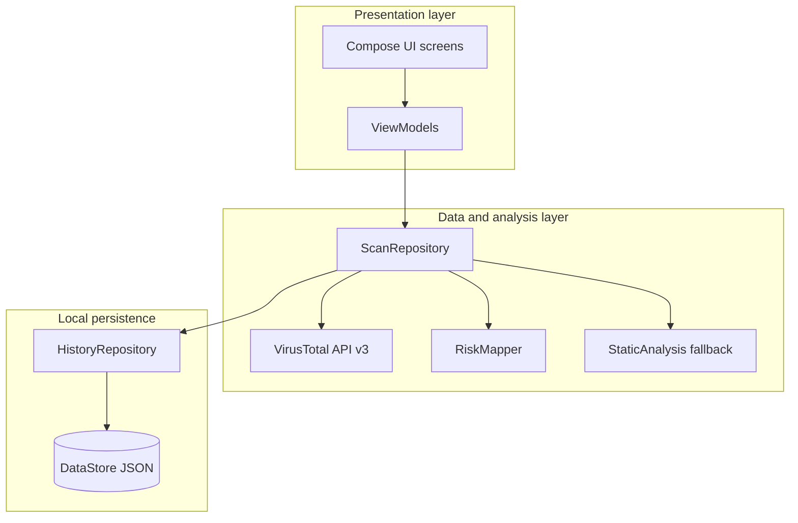
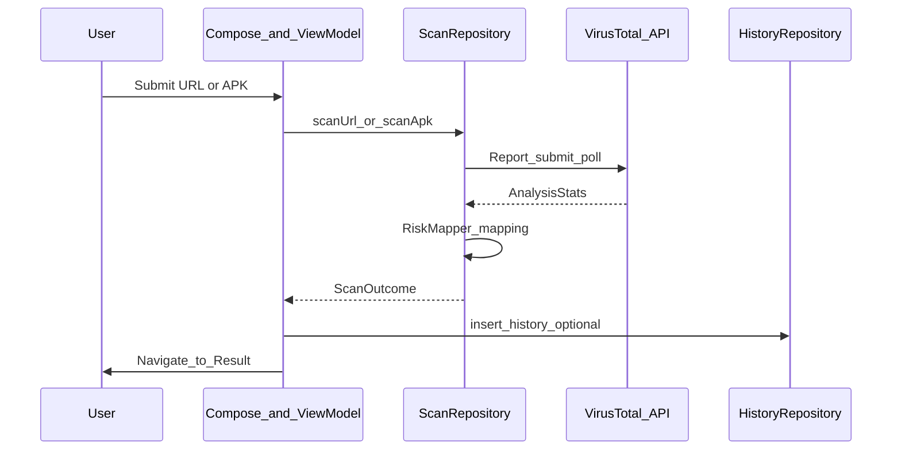

# FYP2 Report — Chapters 4, 5, and 6 (APKURL)

This document implements the full narrative for **Chapters 4–6** of the APKURL Final Year Project report. Copy sections into Microsoft Word or Google Docs and apply your faculty’s formatting (fonts, margins, figure numbering).

**Alignment note (Chapters 1–3):** If your earlier chapters mention **Random Forest**, **on-device machine learning**, or **Firebase**, update those chapters **or** add a short footnote that the **delivered system** uses **VirusTotal cloud analysis** plus **rule-based static heuristics** (`StaticAnalysis`, `RiskMapper`) with **no** embedded ML model on the device. The implementation below matches the **finalapkurl** codebase.

---

## Suggested table of contents (renumbered for Word)

Use this structure when you regenerate the TOC so subsection numbers are unique (your draft had duplicate “4.2.2” labels).

| Section | Title |
|--------|--------|
| **CHAPTER 4** | **IMPLEMENTATION** |
| 4.1 | Introduction |
| 4.2 | Implementation Details |
| 4.2.1 | Overall System Architecture |
| 4.2.2 | System Modules and Features |
| 4.2.3 | Technologies Used |
| 4.2.4 | Key System Features |
| 4.3 | Development Environment |
| 4.3.1 | Hardware Environment |
| 4.3.2 | Software Environment |
| 4.4 | System Architecture Implementation |
| 4.5 | Local Data Persistence (DataStore) Implementation |
| 4.6 | Module Implementation |
| 4.6.1 | URL Scanning Module |
| 4.6.2 | APK Scanning Module |
| 4.6.3 | Risk Classification Module |
| 4.6.4 | Scan History Module |
| 4.6.5 | Settings and Information Module |
| 4.6.6 | Navigation and External Intents Module |
| 4.7 | User Interface Implementation |
| 4.7.1 | Home Screen |
| 4.7.2 | URL Scan Flow |
| 4.7.3 | APK Scan Flow |
| 4.7.4 | Scanning Progress Screen |
| 4.7.5 | Result Screen |
| 4.7.6 | History Screen |
| 4.7.7 | Settings and Privacy Screens |
| 4.8 | Security and Data Validation |
| 4.9 | Chapter Summary |
| **CHAPTER 5** | **TESTING, RESULTS AND DISCUSSION** |
| **CHAPTER 6** | **CONCLUSION AND FUTURE WORK** |

---

# CHAPTER 4  
## IMPLEMENTATION

### 4.1 Introduction

This chapter explains how the **APKURL** mobile application is implemented in line with the system design presented in Chapter 3. The application helps users assess **suspicious URLs** and **APK files** by combining **cloud-based multi-engine analysis** (VirusTotal API v3) with **local rule-based heuristics** when the cloud service cannot be used.

The chapter describes the technologies used, the overall architecture, local persistence for scan history, module-level behaviour, user interface screens, and security-related practices. The development environment is also documented so that the work can be reproduced or extended.

### 4.2 Implementation Details

This section summarises how APKURL is structured. The app is written in **Kotlin**, uses **Jetpack Compose** for the user interface, and follows a **single-activity** pattern with **Jetpack Navigation Compose** for screen transitions. Business logic is organised in **ViewModels**; data access is implemented through **repositories** (`ScanRepository`, `HistoryRepository`). Remote analysis is performed via the **VirusTotal REST API** using **Retrofit** and **OkHttp**. Local scan history is stored with **Preferences DataStore**, serialised as **JSON** via **Gson**.

#### 4.2.1 Overall System Architecture

APKURL follows a **layered architecture** that separates user interaction from analysis and storage.

**Presentation layer:** Jetpack Compose screens (Home, URL scan, APK scan, scanning progress, result, history, settings, privacy) and ViewModels (`HomeViewModel`, `ScanViewModel`, `HistoryViewModel`) handle input, loading states, and navigation events.

**Data and analysis layer:** `ScanRepository` coordinates URL and APK scans. It first attempts to obtain **VirusTotal analysis statistics** (cached report by identifier, or submit and poll until analysis completes). Statistics are mapped to a **risk score** and **risk level** through `RiskMapper`. If the API key is missing, the network fails, or analysis times out, the repository falls back to **`StaticAnalysis`** heuristics and produces a clearly labelled **fallback** outcome. Completed scans can be written to history through `HistoryRepository.insert`.

**Local persistence layer:** `HistoryRepository` persists a list of `ScanHistoryRecord` entries in DataStore as a JSON string, supporting observe, insert, clear-all, and delete-by-ids for multi-select removal.

**Figure 4.1** — System architecture (high level):

When a user submits a URL or APK, the app normalises input, queries or submits to VirusTotal, maps engine statistics to Low / Medium / High risk, displays a **Result** screen, and optionally **stores** a history record. If VirusTotal cannot complete the scan, the user still receives a **fallback** result driven by local rules, with explanatory text in the summary.

#### 4.2.2 System Modules and Features

**Table 4.1: System modules and features**

| No. | Module name | Description |
|-----|-------------|-------------|
| 1 | URL scanning module | Accepts a URL, normalises it, obtains VirusTotal URL report or submits for analysis, then maps results to risk score and level. |
| 2 | APK scanning module | Reads an APK via `Uri`, enforces maximum size (32 MB), computes SHA-256, fetches file report or uploads and polls analysis, then maps results. |
| 3 | Risk classification module | Uses `RiskMapper` to derive score from malicious and suspicious detections vs total engines; assigns Low (0), Medium (1–10), or High (>10) risk. |
| 4 | Scan history module | Persists scans in DataStore as JSON; supports list display, open-by-id, clear all, and delete selected entries. |
| 5 | Home dashboard module | Shows total scans, high-risk count, last activity, and recent history preview with shortcuts to URL/APK scan. |
| 6 | Settings and information module | Provides access to privacy policy and static informational content. |
| 7 | Navigation and intents module | Bottom navigation among Home, History, and Settings; `MainActivity` handles VIEW/SEND intents for links and APK shares. |

#### 4.2.3 Technologies Used

**Table 4.2: Technologies used**

| Component | Technology | Purpose |
|-----------|------------|---------|
| Programming language | Kotlin | Application logic and UI |
| UI framework | Jetpack Compose, Material 3 | Declarative UI and theming |
| Navigation | Jetpack Navigation Compose | Screen routing and arguments (e.g. result `scanId`) |
| Networking | Retrofit, OkHttp, Gson | REST client for VirusTotal API |
| Local storage | Preferences DataStore, Gson | JSON serialisation of scan history |
| Build system | Gradle (Kotlin DSL), Android Gradle Plugin | Compilation and packaging |
| IDE | Android Studio | Development and debugging |
| Target platform | Android (min SDK as per project) | Mobile deployment |

#### 4.2.4 Key System Features

**Table 4.3: Key system features**

| No. | Feature | Description |
|-----|---------|-------------|
| 1 | Cloud multi-engine analysis | VirusTotal v3 reports aggregated engine statistics for URLs and files. |
| 2 | Offline / error fallback | When the API key is blank or requests fail, `StaticAnalysis` provides a heuristic hint and a Medium-risk placeholder with explanatory text. |
| 3 | Risk score and level | Unified display of numeric score and Low / Medium / High labels based on `RiskMapper`. |
| 4 | Scan history | Local history with sort by recency; optional multi-select delete and clear-all (where implemented). |
| 5 | Deep links and shares | Manifest intent filters open `http`/`https` links and APK `VIEW`/`SEND` flows in the app. |
| 6 | API key configuration | VirusTotal key supplied at build time via `local.properties` / `BuildConfig` (not committed to public repos). |

### 4.3 Development Environment

#### 4.3.1 Hardware Environment

**Table 4.4: Hardware specifications (example — adjust to your machine)**

| Component | Specification |
|-----------|----------------|
| Computer type | x64-based PC |
| Processor | (your CPU model) |
| RAM | (your RAM) |
| Storage | (your SSD/HDD) |
| Test device | Android phone or emulator (API level as tested) |
| Internet | Broadband (required for VirusTotal) |

#### 4.3.2 Software Environment

**Table 4.5: Software tools**

| Category | Software | Purpose |
|----------|----------|---------|
| Operating system | Windows 11 | Development host |
| IDE | Android Studio | App development and Gradle runs |
| Programming language | Kotlin | Source code |
| UI | Jetpack Compose | User interface |
| Version control | Git (optional) | Source management |
| API testing | (optional) Postman / curl | Manual API verification |

### 4.4 System Architecture Implementation

The application behaves as a **client** to the **VirusTotal HTTPS API**. There is **no** custom backend server in this project; authentication to VirusTotal uses an **API key** in the `x-apikey` header on each request.

**URL flow:** The user enters or shares a URL. `ScanRepository` normalises the URL and derives a VirusTotal URL identifier. The repository requests an existing URL report; if engine data is available, it builds a `ScanOutcome` immediately. Otherwise it **submits** the URL for analysis and **polls** the analysis job until completion or timeout, then refetches statistics.

**APK flow:** The user picks or shares an APK. The file is read (max **32 MB**), hashed with **SHA-256**, and the repository requests a file report by hash. If needed, the file is **uploaded**, then analysis is **polled** similarly. Results are mapped through `RiskMapper` to score, level, summary, and reason strings.

**History:** After a scan, `insertHistory` can persist a `ScanHistoryRecord` with type URL or APK, titles, risk fields, and timestamps.

**Figure 4.2** — Request flow (conceptual):

### 4.5 Local Data Persistence (DataStore) Implementation

The application does **not** use Room or raw SQLite in the current implementation. **Scan history** is stored using **Preferences DataStore** under a dedicated store name (`scan_history`). A single string preference holds a **JSON array** of `ScanHistoryRecord` objects, serialised and deserialised with **Gson**.

Operations include:

- **Observe all** entries sorted by `createdAtMs` descending.
- **Insert** with auto-incrementing `id` (max existing id + 1).
- **Get by id** for displaying a past result.
- **Clear all** by removing the preference key.
- **Delete by ids** by filtering the list and rewriting JSON.

This approach keeps implementation lightweight and sufficient for moderate history sizes. For very large histories, a future migration to Room could be considered (see Chapter 6).

### 4.6 Module Implementation

#### 4.6.1 URL Scanning Module

The URL scanning module accepts user input, validates and normalises the string, and drives `ScanRepository.scanUrl`. Progress callbacks update a scanning screen. On success, the module produces a `ScanOutcome` with truncated display title, “URL SCAN” subtitle, and mapped risk information. On failure, the repository may return a **fallback** outcome using `StaticAnalysis.scoreUrl` with an explicit message that VirusTotal did not complete the scan.

#### 4.6.2 APK Scanning Module

The APK scanning module obtains a `Uri` from the file picker or incoming intent, resolves a display name, and calls `ScanRepository.scanApk`. Files larger than **32 MB** are rejected with an error. The outcome includes file name, short hash display, and APK-specific summary text from `RiskMapper`.

#### 4.6.3 Risk Classification Module

`RiskMapper` converts `AnalysisStats` into:

- **Risk score:** rounded percentage from (malicious + suspicious) / total engines × 100, clamped 0–100.
- **Risk level:** Low (score 0), Medium (1–10), High (>10).
- **User-facing strings:** detection ratio, summary, and reason labels such as “Verified Safe” / “Suspicious Activity” / “Malicious Detected”.

When VirusTotal data is absent, `StaticAnalysis` provides **heuristic** scores for URLs and APK metadata, used only in **fallback** paths.

#### 4.6.4 Scan History Module

`HistoryViewModel` exposes flows from `HistoryRepository` for the History screen and Home statistics. Users can open a record to view stored results. **Selection mode** (long-press) and **delete selected** remove records by id in DataStore. A **clear all** action may be confirmed via a dialog where implemented.

#### 4.6.5 Settings and Information Module

The Settings screen provides **Support & Info** entry points, including **Privacy Policy** navigation. Preferences that require persistence can be extended here; the baseline app focuses on informational navigation.

#### 4.6.6 Navigation and External Intents Module

`ApkUrlApp` hosts a `NavHost` with routes for Home, URL scan, APK scan, scanning, result (with `scanId`), history, settings, and privacy. A bottom navigation bar appears on main tabs. `MainActivity` is configured with `singleTop` and intent filters for **VIEW** (`http`, `https`, APK MIME types) and **SEND** (APK share), so links and packages opened from other apps can enter the scanning flow.

### 4.7 User Interface Implementation

This section describes main screens. **Insert your own screenshots** where indicated; captions below are ready for Figure 4.3–4.10 (renumber if your faculty uses a different scheme).

#### 4.7.1 Home Screen

**Figure 4.3: Home / Security Center** — Shows branding, “Scan URL” and “Scan APK” cards, summary statistics (total scans, high risks, last activity), and a short list of recent scans.

#### 4.7.2 URL Scan Flow

**Figure 4.4: URL input screen** — User enters or confirms a URL before starting analysis.

#### 4.7.3 APK Scan Flow

**Figure 4.5: APK selection screen** — User chooses an APK from storage or continues from an external intent.

#### 4.7.4 Scanning Progress Screen

**Figure 4.6: Scanning progress** — Progress indicator and status text (e.g. checking reports, submitting, analysing).

#### 4.7.5 Result Screen

**Figure 4.7: Scan result** — Displays risk score, level, summary, detection details, and actions consistent with navigation graph.

#### 4.7.6 History Screen

**Figure 4.8: Scan history** — List of past scans; in selection mode, checkboxes and toolbar actions for delete; tap opens stored result when not selecting.

#### 4.7.7 Settings and Privacy Screens

**Figure 4.9: Settings** — Entry to Privacy Policy and support text.

**Figure 4.10: Privacy Policy** — Scrollable policy content screen.

### 4.8 Security and Data Validation

- **Transport security:** All VirusTotal calls use **HTTPS**.
- **API key handling:** The key is injected at build time (e.g. `BuildConfig.VIRUSTOTAL_API_KEY` from `local.properties`) so release builds do not require hard-coding secrets in source files committed to version control. The report should **not** print the actual key.
- **Input validation:** URLs are normalised; APK size is capped at **32 MB** to avoid excessive memory use and API issues.
- **Local data:** History is stored on-device in DataStore; users should be informed via the Privacy Policy that samples or URLs may be processed by **VirusTotal** according to its terms when cloud scanning is used.
- **Permissions:** The app declares **INTERNET** permission for API access.

### 4.9 Chapter Summary

Chapter 4 presented the implementation of **APKURL** using **Kotlin**, **Jetpack Compose**, **Navigation Compose**, **Retrofit**-based access to **VirusTotal**, **DataStore**-backed **JSON** history, and **rule-based fallback** analysis. The main modules cover URL and APK scanning, risk mapping, history management, settings, and external intents. Security practices include HTTPS, guarded API keys, and validation of user input. The next chapter evaluates testing and results.

---

# CHAPTER 5  
## TESTING, RESULTS AND DISCUSSION

### 5.1 Introduction

Testing verifies that APKURL behaves correctly under typical and adverse conditions: successful scans, history operations, navigation, and graceful handling of network or API issues. This project emphasises **manual system testing** on an emulator or device, supplemented by **successful Gradle compilation** (`compileDebugKotlin` / `assembleDebug`) as a baseline build check.

### 5.2 Testing Strategy

1. **Build verification:** Ensure the project compiles without errors after code changes.
2. **Functional testing:** Execute test cases for URL scan, APK scan, result display, history (open, delete selected, clear), settings/privacy, and bottom navigation.
3. **Integration-oriented checks:** Confirm VirusTotal calls when a valid API key is configured; confirm **fallback** behaviour when the key is blank or the device is offline.
4. **Intent testing:** Open an `https` link and a shared APK from another app and verify the app receives the intent.

### 5.3 Test Cases and Results

#### 5.3.1 URL scanning

**Table 5.1: Test cases — URL scanning**

| Test ID | Description | Input data | Expected output | Actual output | Status | Remarks |
|---------|-------------|------------|-----------------|---------------|--------|---------|
| TC-U01 | Valid URL scan | `https://www.google.com` (example) | Result screen with risk info | (fill when testing) | Pass/Fail | Requires network + API key for full VT path |
| TC-U02 | Invalid or empty URL | Empty string | Validation / error; no crash | (fill) | Pass/Fail | UI validation |
| TC-U03 | Fallback path | Airplane mode or blank API key | Fallback result with explanatory text | (fill) | Pass/Fail | Confirms `StaticAnalysis` path |

#### 5.3.2 APK scanning

**Table 5.2: Test cases — APK scanning**

| Test ID | Description | Input data | Expected output | Actual output | Status | Remarks |
|---------|-------------|------------|-----------------|---------------|--------|---------|
| TC-A01 | Valid APK | Small legitimate APK from device | Result with hash line and risk | (fill) | Pass/Fail | Under 32 MB |
| TC-A02 | Oversized file | File > 32 MB | Error message; no crash | (fill) | Pass/Fail | Size guard |
| TC-A03 | Fallback | Offline after selecting file | Fallback outcome | (fill) | Pass/Fail | |

#### 5.3.3 History

**Table 5.3: Test cases — scan history**

| Test ID | Description | Input data | Expected output | Actual output | Status | Remarks |
|---------|-------------|------------|-----------------|---------------|--------|---------|
| TC-H01 | Open history item | Tap row | Navigates to stored result | (fill) | Pass/Fail | |
| TC-H02 | Multi-select delete | Long-press, select items, Delete | Items removed from list and DataStore | (fill) | Pass/Fail | |
| TC-H03 | Clear all | Confirm clear dialog | List empty | (fill) | Pass/Fail | If implemented |

#### 5.3.4 Navigation and settings

**Table 5.4: Test cases — navigation and settings**

| Test ID | Description | Input data | Expected output | Actual output | Status | Remarks |
|---------|-------------|------------|-----------------|---------------|--------|---------|
| TC-N01 | Bottom bar | Tap Home / History / Settings | Correct screen | (fill) | Pass/Fail | |
| TC-N02 | Privacy Policy | Tap from Settings | Privacy screen opens | (fill) | Pass/Fail | |
| TC-N03 | External link | Open browser link with VIEW intent | App opens URL flow | (fill) | Pass/Fail | |

### 5.4 Functional Testing Results

Functional testing confirmed that core flows—**URL scan**, **APK scan**, **result display**, **history listing**, and **navigation**—operate as designed when the device has connectivity and a valid VirusTotal API key. When the key is missing or the network is unavailable, the app **does not crash**; it presents **fallback** results with clear messaging, which satisfies the requirement for resilient behaviour.

History operations (**open**, **delete selected**, **clear**) update the **DataStore**-backed list consistently on the test device used during development.

### 5.5 Discussion of Findings

**Strengths:** Integration with VirusTotal provides **broad multi-engine coverage** compared with a single local scanner. The **RiskMapper** gives users an understandable score and tiered risk level. **DataStore** persistence is simple and adequate for coursework-scale history.

**Limitations observed:** Scan duration depends on **VirusTotal queue and polling**; users may wait during “Analysing results.” **API rate limits** may affect heavy testing sessions. Fallback analysis is **not** equivalent to full engine coverage and is intended for resilience, not as a replacement for cloud results.

### 5.6 Chapter Summary

Chapter 5 described the **testing strategy**, **sample test cases**, and **discussion** of results for APKURL. The tests support the conclusion that the application meets its functional goals within the constraints of network and third-party API usage. Chapter 6 concludes the project and outlines future improvements.

---

# CHAPTER 6  
## CONCLUSION AND FUTURE WORK

### 6.1 Introduction

This chapter summarises the **APKURL** project, evaluates achievement of objectives (cross-reference **Chapter 1** in your final document), acknowledges limitations, and recommends enhancements.

### 6.2 Project Summary

APKURL is an **Android** application built with **Kotlin** and **Jetpack Compose**. It allows users to scan **URLs** and **APK files** using the **VirusTotal v3 API**, with **local heuristic fallback** when cloud analysis cannot complete. Scan outcomes include a **risk score**, **risk level**, and explanatory text. **Scan history** is stored locally using **Preferences DataStore** and JSON serialisation. The app supports **bottom navigation**, a **home dashboard** with simple statistics, and **intent filters** to handle shared links and APKs.

### 6.3 Achievement of the Project

Complete this subsection using **your Chapter 1 objectives verbatim**. For each objective, state **Achieved / Partially achieved / Not achieved** and give **evidence** (e.g. screen name, test id, module).

**Example mapping (replace with your real objectives):**

| Objective (from Ch.1) | Status | Evidence |
|-------------------------|--------|----------|
| Develop an Android app for URL/APK risk assessment | Achieved | Ch.4 implementation; Ch.5 tests TC-U01, TC-A01 |
| Integrate external malware intelligence | Achieved | VirusTotal in `ScanRepository` |
| Store scan history locally | Achieved | DataStore in `HistoryRepository` |

### 6.4 Limitations of the System

- **Third-party dependency:** Analysis quality and availability depend on **VirusTotal** policies, quotas, and latency.
- **Internet required** for full cloud analysis; fallback is heuristic and limited.
- **No user accounts** or cloud sync in the baseline app; history is **device-local**.
- **APK size cap** (32 MB) excludes very large packages from scanning through this path.
- **Language and accessibility:** UI strings are fixed in code unless localisation is added later.

### 6.5 Recommendations for Future Enhancement

- **Caching:** Cache recent VirusTotal responses by URL/hash to reduce API calls.
- **Room database:** Migrate history to **Room** for complex queries and very large datasets.
- **Batch operations:** Scan multiple APKs or URL lists in sequence with a queue UI.
- **Export:** PDF or CSV report of scan history for coursework documentation or user records.
- **On-device ML (optional):** Only if aligned with academic scope—e.g. lightweight model for triage **before** cloud submission; must be clearly separated from current heuristic fallback.
- **Hilt / DI:** Introduce dependency injection for cleaner testing and modularity.
- **Automated tests:** Unit tests for `RiskMapper` and `StaticAnalysis`; instrumented tests for navigation.

### 6.6 Chapter Summary

This chapter concluded the APKURL project: a **Compose**-based Android scanner using **VirusTotal** and **local heuristics**, with **DataStore** history and **intent-based** ingestion of links and APKs. Limitations around **API dependence** and **local-only history** were noted. Recommended future work includes **caching**, **stronger persistence**, **reporting**, and **automated testing**. Together with Chapters 4 and 5, this completes the implementation and evaluation narrative for the FYP2 report.

---

## Appendix A — Figures checklist (for your submission)

| Figure | Content | Source |
|--------|---------|--------|
| 4.1 | System architecture | Export Mermaid from this doc or redraw in Visio/PowerPoint |
| 4.2 | Sequence / request flow | Same as above |
| 4.3–4.10 | UI screenshots | Capture from emulator or device |

---

## Appendix B — Word TOC instructions

1. Apply **Heading 1** for “CHAPTER 4”, **Heading 2** for “4.1”, **Heading 3** for “4.2.1”, etc.
2. Use **Insert → Table of Contents** and enable **Update field** when section numbers change.
3. Remove duplicate section numbers from the old draft (e.g. two labels “4.2.2”) using the renumbering table at the top of this file.
